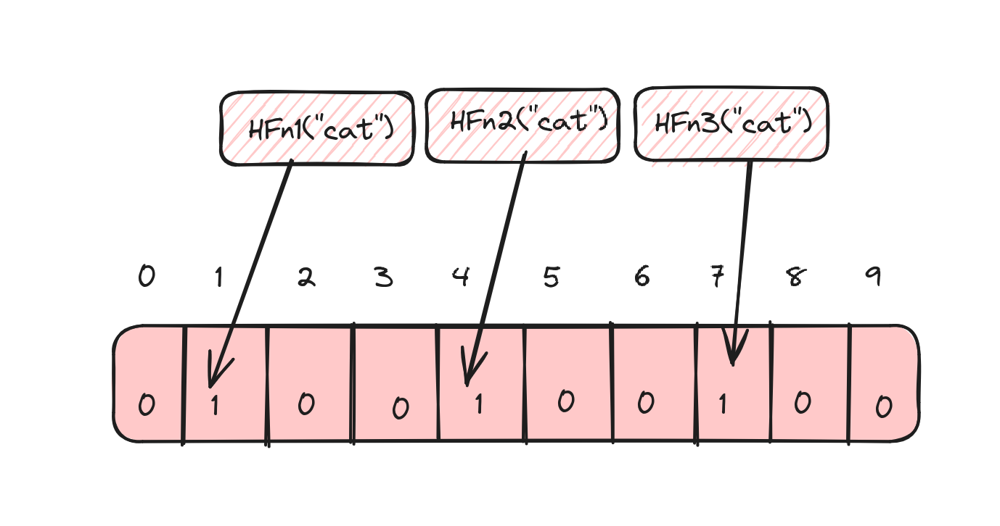
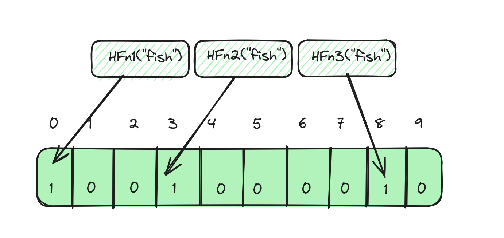
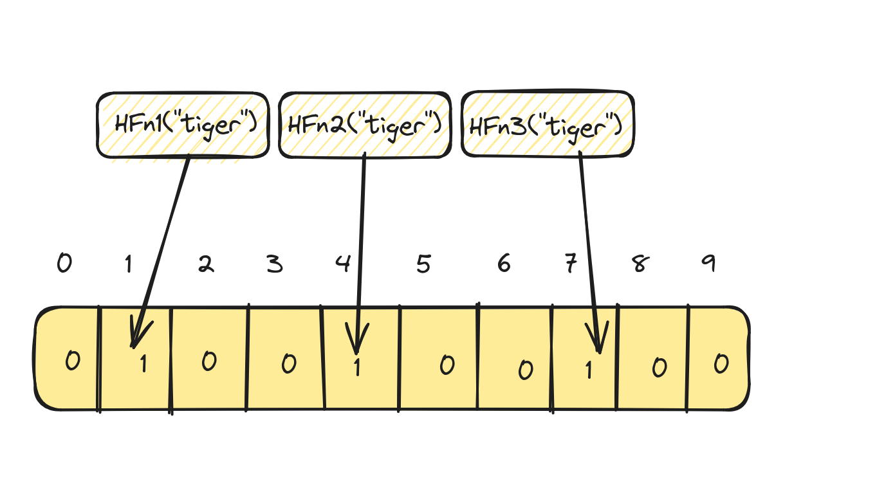

In this blog post let's discuss all about Bloom Filters at length, learn how they work, explore their interesting
characteristics, advantages, disadvantages, tradeoffs and other important intricacies that one should be aware of.

<!-- more -->

## What are Bloom Filters?

Bloom Filters are probabilistic data structures that quickly help determine if an element is present in a set or not.

## Let's start with an example

Let's assume that you're given a word list containing 5 words, and that you're asked to determine if another word given
to you exists in the word list or not. How would you do it? Take sometime to think about it before reading on!

Here are a few ways to do that:

* search for each word in the word list from start to end (linear search)
* sort the words in the word list in alphabetical order and search in the section of the list that's likely to contain
  the word (binary search).
* put the words into a hashmap and use `get()` on the hashmap

Here is a simple program on how each one of these approaches work:

#### Program to search for word using linear search

```python
from typing import List

input_word = "cat"
word_list = ["ape", "cat", "bear", "fish", "lion"]


def word_exists_ls(input_word: str, word_list: List[str]) -> bool:
    for word in word_list:
        if word == input_word:
            return True
    return False
    # In python, you can simply do the following one liner too:
    # return input_word in word_list
```

This approach goes through every word in the list and so it take `O(N)` time complexity to find if a word exists in the
list or not.

#### Program to search for a word using binary

```python
from typing import List

input_word = "cat"
word_list = ["ape", "cat", "bear", "fish", "lion"]


def word_exists_bs(input_word: str, word_list: List[str]) -> bool:
    if not word_list or not input_word:
        return False
    left = 0
    word_list = sorted(word_list)
    right = len(word_list) - 1
    while left <= right:
        mid = (left + right) // 2
        curr_word = word_list[mid]
        if curr_word == input_word:
            return True
        elif input_word < curr_word:
            right = mid - 1
        else:
            left = mid + 1
    return False
```

The time complexity in this case is `O(logN)` where N is the number of strings in the word list.

#### Program to search for a word using a hashmap:

```python
from collections import Counter
from typing import List

input_word = "cat"
word_list = ["ape", "cat", "bear", "fish", "lion"]


def word_exists_hm(input_word: str, word_list: List[str]) -> bool:
    # Counter is an easy way to convert list to dict with count of
    # each word in the above case it will look like: 
    # Counter({'ape': 1, 'cat': 1, 'bear': 1, 'fish': 1, 'lion': 1})
    word_map = Counter(word_list)
    return word_map.get(input_word) is not None
```

Now in this approach, we can achieve the lookup in constant time or `O(1)` time complexity.

### That works fine right, then why Bloom filters?

If you haven't already noticed, in our example we only had 5 words and everything was computed in memory. In all of
the above methods, the space complexity to store the words is `O(N)`. Now what if we need to determine if the given
input word is in a list that has `1 billion` strings in it? Suddenly, it becomes a large number of strings to put into a
hashmap and to hold them in memory.

So, how much memory do `1 billion` strings actually occupy? Though that depends upon the programming language and the
implementation of the string data type, let's assume the following:

* each string consists of only `ASCII` characters
* length of each string is 10 characters or `~10 bytes` in size.
* plus, there is `~50 bytes` of overhead to store a string in Python.

```python
>> > import sys
>> > s1 = "foobar1223"
>> > print(sys.getsizeof(s1))
59
```

So, to store `1 billion` strings, a quick back of the napkin math would yield about `60 GB` of
memory (`60 bytes * 10 ^ 9`). For `10 billion` strings, that numbers is `600 GB` and that's assuming that the strings
are not longer than 10 characters.

Now, what if there are unicode strings that are 20 characters long? Long story short, there should be a bound way to
find out if a string is in a set of `1 billion` or `10 billion` or even `100 billion` strings.

### Bloom filters to the rescue!

If you were patient enough to read thus far, then you would have already realized why we need bloom filters. Now let's
look at how they work. Let's go back to the text book definition that we saw earlier:

> Bloom Filters are probabilistic data structures that quickly help determine if an element is present in a set or not.

Bloom filters are `probabilistic` datastructures and this means that we approximate the results rather than providing
accurate results. This approximation is what makes it possible to work with unbounded input but still design a
data structure that could behave in a bounded manner.

### How do Bloom Filters work?

Let's learn about the working of Bloom Filters through the above example using a word list and an input word.

#### Insertion

To use a Bloom filter, we first need to insert all the words in our set into it. In our example w had 5 words. To do
this in the simplest way for me to explain, let's do the following:

* Take a fixed length bit array of length 10.
* Set all the entries to 0 to begin with.
* Use N different hash functions to compute the hash of each string. For illustration, we'll use 3 (realistically
  speaking you would use more).
* Set the bits at the respective indices of the array.

For the word `cat`, this would look like this:

* Hash function `HFn1("cat")` = 1
* Hash function `HFn2("cat")` = 4
* Hash function `HFn2("cat")` = 7

So, set the bits in indices `1, 4 and 7` in the array.



Similarly, for the word `fish`, if the results of the hash functions are `0, 3 and 9`, then it would look like:



#### Look up

To check if a word exists or not in our word list, we should first compute the three different hashes for our input word
and check if the index corresponding to the value of each hash is actually set in the bit array.
So, for the word `cat`:

* Hash function `HFn1("cat")` = 1
* Hash function `HFn2("cat")` = 4
* Hash function `HFn2("cat")` = 7

We would check if the indices 1, 4 and 7 in our array has bits set to 1. If they are set, then the word exists. If not,
then the word doesn't exist.

### The catch!

All good right?. But wait, there's a catch!

> There could be false positives!

Now let's say for the word `tiger`, we apply the three different hash functions and get exactly the same values
as `cat`:

* Hash function `HFn1("tiger")` = 1
* Hash function `HFn2("tiger")` = 4
* Hash function `HFn2("tiger")` = 7



A keen eye would notice that the word `tiger` is not in our word list to begin with! In this case, the bloom filter
returns us a false sense of assurance that the word `tiger` is in the word list when it's the word `cat`
that's actually in the word list. So, the side effect of Bloom Filters is that they result in **false positives**.

But on the bright side, they never return false negatives. So, this is the catch and this is why we refer to Bloom
Filters as probabilistic data structures - the result is simply an approximation.

### Deletion

What if we want to remove a word from our word list, would that work? Not quite!

One other characteristic of Bloom Filters is that we can only add elements to them, but deletion is not supported. This
is because, multiple elements can set the same bits to 1 and resetting those bits is practically impossible as the other
elements might be also using/sharing those bits.

### How long should your array be?

In the later part of this post, we'll try and implement a Bloom Filter from scratch, but there are several parameters of
a Bloom Filter that we should learn how to choose if we want to design a Bloom Filter ourselves.

One of the important parameters to understand is the array size. In our examples, we used a fixed 10 long bit array. But
in reality, this array length could be much longer. So, how do you actually decide how long your array should be?

Let's assume that $m$ is the desired length of your bit array, $n$ is the number of elements that you desire to insert
into the bloom filter and $p$ is the probability of false positives that you desire, then to calculate $m$, we can use
the following formulae:

$$
m=-\frac{n * ln(p)}{{ln(2)}^2}
$$

Here $ln$ is natural logarithm ($log$ $base$ $e$).

### How do you calculate the probability of false positives?

If `m` is the length of the bit array, $k$ is the number of hash functions and $n$ is the number of elements that are to
be inserted into the bloom filter, then the probability of false positives $p$ can be calculated as follows:

$$
p = (1 - [1 - \frac{1}{m}]{^k}{^n} )^k \approx (1 - {e^{\frac{-kn}{m}}} ) ^ k
$$

Since $e^{-1}$ can be represented as follows.

$$
{\displaystyle \lim _{m\to \infty }\left(1-{\frac {1}{m}}\right)^{m}={\frac {1}{e}} = e^{-1}}
$$

We will not dive into the complete proof, but you can read more on
it [here](https://en.wikipedia.org/wiki/Bloom_filter#Probability_of_false_positives).

### How many hash functions should you use?

In our examples, we used three different hash functions, but how many should you use? Let's assume that `k` is the
number of hash functions used, `m` is the length of the bit array and `n` is the number of elements, then the optimal
number of hash functions that you should use can be calculated using the following formulae:

$$
k=\frac{m}{n} * ln (2)
$$

Here $ln$ is natural logarithm ($log$ $base$ $e$).

### What hash functions should you use?

Choosing the right hash functions is very important for the efficiency and effectiveness of a Bloom Filter. But how do
you decide which hash functions to choose? The hash function that you should use should be stable, provide a uniform
distribution and at the same time be fast. For these reasons, fast but simple non-cryptographic hashes should be
preferred. Some options are:

* FNV
* Murmur
* Jenkins
* DJB2

### Let's implement a Bloom Filter

Let's look at a simple implementation of a Bloom Filter to better understand the concepts that we discussed so far in
this
post. For simplicity, we will only use `one` hashing algorithm - in this case Murmur hash. We will achieve 3 different
unique hash
values by adjusting the `seed` parameter to murmur hash.

```python
# pip install mmh3
import math
import mmh3
from typing import List


class BloomFilter:
    def __init__(self, n: int, p: int):
        self.p = p
        self.n = n
        self.array_size = self._determine_array_size(self.n, self.p)
        self.bit_array = [0] * self.array_size
        self.num_hash_funcs = self._determine_num_hash_funcs(self.array_size, self.n)
        self.size = 0

    def _determine_num_hash_funcs(self, m: int, n: int) -> int:
        k = (m / n) * math.log(2)
        return math.ceil(k)

    def _determine_array_size(self, n: int, p: int) -> int:
        m = -(n * math.log(p) / math.log(2) ** 2)
        return math.ceil(m)

    def _get_hashes(self, s: str) -> List[int]:
        hashes = []
        for hc in range(self.num_hash_funcs):
            hash = mmh3.hash(s, hc) % self.array_size
            hashes.append(hash)
        return hashes

    def add(self, word: str):
        hash_values = self._get_hashes(word)
        for hv in hash_values:
            self.bit_array[hv] = 1
        self.size += 1

    def contains(self, word: str) -> bool:
        hash_values = self._get_hashes(word)
        return all(self.bit_array[hash_val] == 1 for hash_val in hash_values)


if __name__ == "__main__":
    n = 1000
    p = 0.01  # 1/100 or 1%
    bloom_filter = BloomFilter(n, p)
    bloom_filter.add("foo")
    bloom_filter.add("bar")
    bloom_filter.add("dog")
    bloom_filter.add("apple")
    print(bloom_filter.contains("tiger"))
    print(bloom_filter.contains("dog"))
    print(bloom_filter.contains("sheep"))
    print(bloom_filter.contains("bar"))
```

### Let's talk complexity

Finally, it's important to understand why Bloom Filters are preferred over other datastructures or methods of finding
the existence of an element in a set, some of which we saw earlier in the post.

#### Time complexity

* Insertion: $O(k)$ to compute k number of hashes and set k bits
* Lookup: $O(k)$ to compute k number of hashes and check k bits
* Deletion: Not supported

#### Space complexity

* $O(m)$, where:
    * $m$ is the size of the bit array, and $m=-\frac{n * ln(p)}{{ln(2)}^2}$
    * $n$ is the number of elements to be inserted into the bloom filter
    * $p$ is the probability of false positives.

### Summing up

Overall Bloom Filters are excellent datastructures if:

* You don't worry about false positives i.e. you're ok getting inaccurate results.
* If you need constant time operations to find out if an element exists in a set or not.
* If you don't need to delete elements once they are added to the Bloom Filter.
* If you need linear space (proportionate to the number of elements that you're trying to insert).

I hope that this post was helpful. It's a long post already, and we could definitely drill down deeper into some of the
topics. But that will be in follow-up posts where I will try to cover some of the finer details about Bloom Filters
which I found hard to cover in this post.
