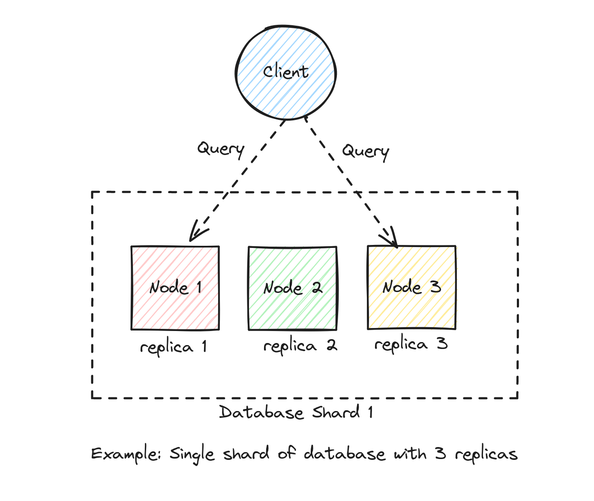
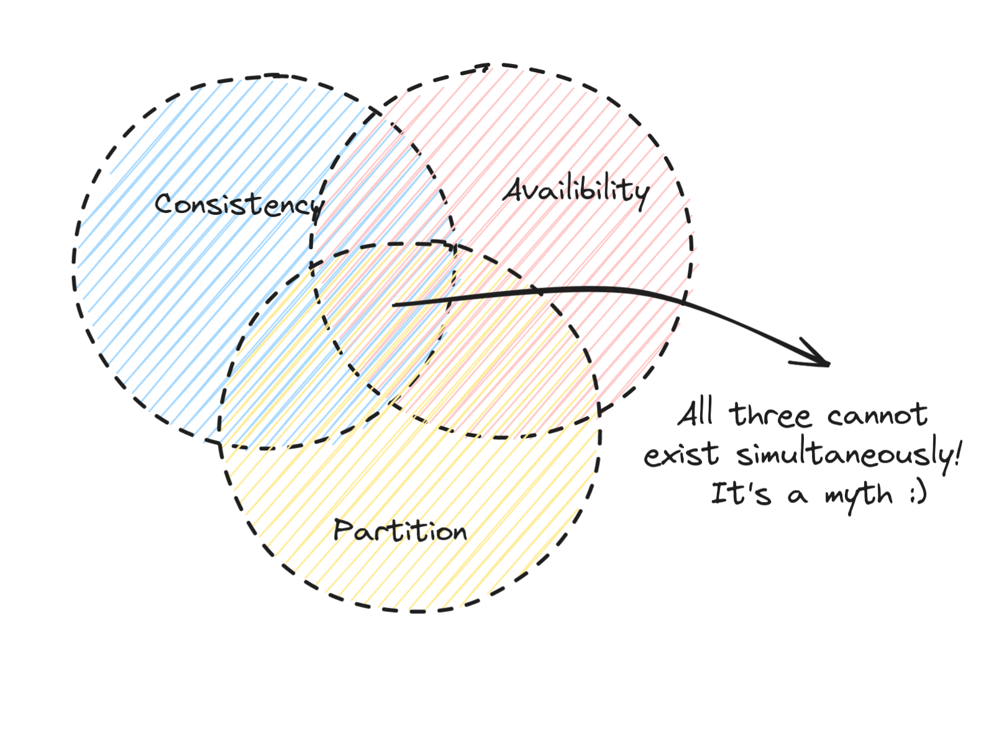

CAP theorem is one of the fundamental principles in distributed systems that's important to understand. In this post,
let's learn more about the CAP theorem and understand how this theorem is applicable to real world distributed systems.

<!-- more -->

## CAP

CAP stands for Consistency, Availability and Partition Tolerance.

To better understand each of these terms, let's assume that:

* We have a simple system of servers consisting of 3 nodes, `node1`, `node2` and `node3`.
* Each of these nodes are replicas of a database shard `replica1`, `replica2` and `replica3`.
* Each of these replicas contain exactly the same set of data.
* A client can connect to any of these replicas and query for the data they need.
* A client can connect to any of these replicas and insert data.
* Data inserted into one replica will be replicated to the other replicas.
* If the data contained in any one of the replicas differs from the others, then the replicas are
  considered inconsistent.

This is as shown below in the diagram. A node, a replica, a host or a server all mean the same for the purposes of this
example.

### Consistency

The property of consistency guarantees that all the nodes return the exact same results regardless of which node the
clients query.

### Availability

The property of availability guarantees that the clients querying are guaranteed a result even if one or
more nodes in the system are down (even if the results are inconsistent).

### Partition Tolerance

Partition tolerance refers to the durability of distributed systems. In case of an event like a network partition, the
distributed system continues to operate without any downtime.

## Understanding CAP theorem

Now, having understood consistency, availability, and partition tolerance. The CAP theorem states the following:

> In a distributed system, it's impossible to guarantee all the three properties of Consistency(C), Availability(A) and
> Partition tolerance(P) simultaneously.

Since network partitions are sort of unavoidable in real world distributed systems, in case of a network partition, we
should optimize for one of the following:

* AP - The system is highly available(A) during a network partition(P), sacrificing consistency(C).
* CP - The system is highly consistent(C) during a network partition(P), sacrificing availability(A).

## AP and CP

Let's try and learn through the example above. In our example, if a client writes to replica
1, then the data would be automatically be replicated to the other two replicas.

Let's imagine that there is a network partition that causes replica 1 to go offline just after the client finishes
writing the data, but before it can be fully replicated to the other two replicas. In this scenario, the data between
the nodes will be inconsistent.

### AP

If we design a system that's highly available, then we can ensure that replicas 2 and 3 that are up will always return a
result
to a query even if the results that they have with them are not the up to date. We will hope that when replica 1 comes
online, the other two replicas will become eventually consistent.

### CP

On the other hand, if we were to design a system that is highly consistent, we need to pick consistency over
availability. In this scenario, even if the replicas 2 and 3 are online since the results are not consistent, we won't
return any results at all until both the replicas have caught up with replica 1.

## AP vs CP in real world distributed systems

Some distributed systems that prioritize availability:

* Cassandra
* DynamoDB

Some distributed systems that prioritize consistency:

* ETCD
* HBase

That basically wraps our post on CAP theorem. I hope that this post helped you understand what CAP theorem is and how it
can be leveraged to design a distributed systems with certain tradeoffs to either consistency or availability.