Databases can typically store billions or even trillions of records and when it comes to data retrieval,
it needs to be fast. In this post, we will learn about sparse indexes, which are specialized datastructures
that help databases with efficient data retrieval.

<!-- more -->

## Introduction

> **Note:** Before you read on, to better understand database indexes thoroughly, I recommend that you read more
> about [database indexes](https://en.wikipedia.org/wiki/Database_index) first.

Databases organize and store records and write them to disk as datafiles. When it comes to querying the data, we
couldn't possibly know which file has the records matching a query unless we iterate through each and every datafile
there is. So, how could we possibly know which datafile contains the records that we want?

This is the exact problem that database indexes intend to solve. A database index holds a pointer to the actual record
in a datafile so that it's easy to locate the record.

### Two common types of database indexes that you should know

There are two very common types of database indexes - dense and sparse database indexes. If there's a pointer to every
record there is in a datafile, then that's known as a dense index. On the other hand, if there is a pointer for a block
of records, then that's known as a sparse index.

In this article, we will discuss more about sparse indexes.

## Sparse indexes

Sparse indexes skip storing a pointer to each and every record that's present in a database and only store pointer to a
block of records and where that block is present on disk. This is called a sparse index.

For example, let's consider that a database that contains a student table with 1000 rows and fields `id`, `name`
and `dob`. To visualize a sparse index, let's assume that the records are physically stored on disk as `blocks` and
there are `5` entries per block. For `1000` database records, there will be `200` such blocks.

Now, if we were to create a sparse index on those `1000` records, we would get one index entry per block and only `200`
index entries altogether.

On the other hand, if the index were to be a dense index, we would store one index entry per record. So, for `1000`
records, we would have `1000` index entries.

## Why use a sparse index?

From the above examples, you might have already observed that sparse indexes store `5x` lesser entries to data than
dense indexes (`200` entries vs `1000` index entries). Now, imagine if there are millions or even billions of records in
a database. Indexing each record would mean that dense indexes would consume `5x` more space on disk (ignoring data
compression and other factors).

Disk space can quickly become a problem when you've got a lot of records to index. In such scenarios sparse indexes can
come in handy.

## Some calculations

Let's try to do some calculations on the space required to store index entries (pointers to actual data on disk).

For our example above, we can calculate the total space needed to store and index 1000 records. Let's assume that each
record in the student table consists of the following:

* `id` - 4 Bytes
* `name` - 50 Bytes
* `dob` - 8 bytes (assuming timestamp format)

Total size of each `record`: `4 + 50 + 8 = 62 Bytes`.
For 1000 records: `62 Bytes * 1000 = 62,000 Byes ~ 62 KB`

Assuming that we index by `dob` as illustrated in the example, each index entry would contain the following:

* `dob`: `4 Bytes`
* Block ID that references the location of the record on disk: `4 Bytes`
* Record Offset: Position of the record within that block: `4 Bytes`

Total space occupied by each index entry: `4 + 4 + 4 = 12 Bytes`

#### Space used by a sparse index

If there's a sparse index entry for every 5 records: `1000/5 = 200 index entries`. Total space occupied by `200` index
entries: `200 * 12 Bytes = 2400 Bytes ~ 2.4 KB `

#### Space used by a dense index

Since there's a index entry per record for dense index, for 1000 records, there would be `1000` index entries. Total
space occupied by `1000` index entries: `1000 * 12 Bytes = 12,000 Bytes ~ 12 KB`

As you might be able to observe already, we are using `5x` less space to index `1000` entries using a sparse index as
compared to a dense index.

## Hidden costs of a sparse index

### Extra disk reads

As much space as sparse indexes might be able to save, since the granularity of these indexes don't directly point to
the exact location of a record on disk, additional disk reads are necessary to further do sequential reads on index
entries to filter down and locate the matching records. This makes them less efficient than dense indexes as they point
directly to where a given record is located on the disk which saves disk reads.

### Increased search times

Since we need extra reads to disk, we consequentially spend more time searching for the records with in the block
essentially increasing search times.

### Complexity

There are certain types of queries where the sparse indexes might not work well. For instance, range queries. For range
queries, we would need more disk I/O operations to scan records sequentially spanning different blocks leading to
increased query time and complexity.

## Summing up

To sum up, sparse indexes offer good flexibility when we need to trade between space and time. If disk space is limited
or if there are trillions of entries in a database, and we can't afford to maintain an index entry for each and every
record, then naturally sparse indexes are a great choice. For use cases where the number of records are small or disk
space is abundant, and when we need to optimize for speed over space, we can use dense indexes.

I hope that this post was able to give you a high level overview about sparse indexes, their advantages, disadvantages
and when to use them.